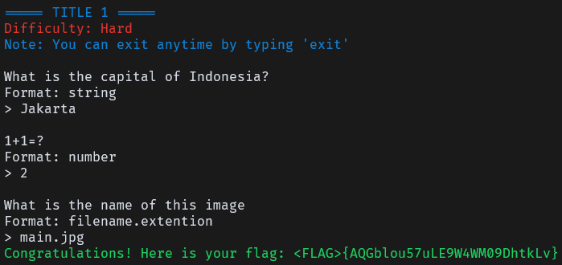
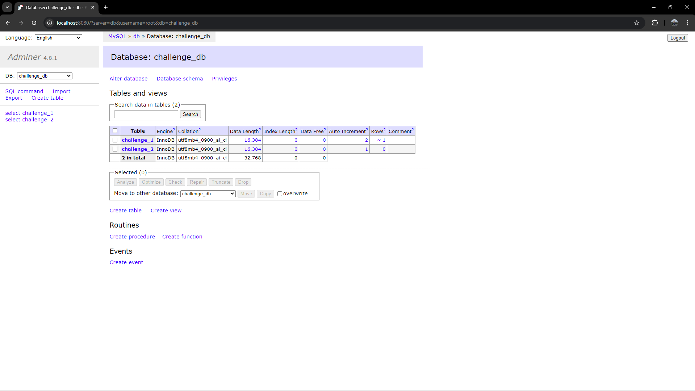
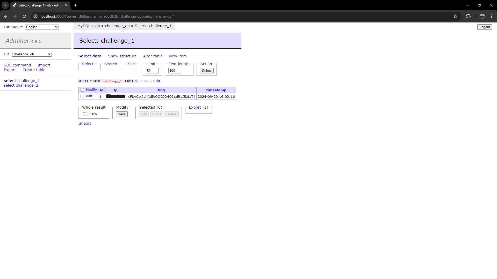

# PYTHON SCRIPT VALIDATOR
This project is designed to validate Python scripts in a Dockerized environment. It can be used for various purposes, including:
- **CTF (Capture The Flag) Challenges**: Automatically validate answers submitted by players for Python-based challenges.
- **Code Review Automation**: Validate code for syntax, logic, and structure before deployment.
- **Python Learning Platform**: Use it as a backend to check Python exercises for students.

## FEATURES
- **Database Integration**: Stores challenge data and user progress in MySQL, ensuring persistent storage.
- **Dockerized Environment**: Each component runs in isolated containers, simplifying deployment and scaling.
- **Customizable**: Easily add new challenges by updating the `src/` directory with new Python scripts and challenge configurations.

## PREVIEW CLIENT SIDE


## PREVIEW DB SIDE



## Add Questions
To add your Python questions or scripts, simply place them in the `src/` directory. Each challenge must include the following configurations:

- **flag**: The expected answer or validation key for the script.
- **title**: The name of the challange.
- **difficulty**: Set the challenge level (easy, medium, hard).
- **question**: A description of the task to be solved.
- **answer**: The expected solution for the task.
- **port**: The service port for the challenge. (adjust as needed).
- **challenge**: Identifier for the challenge, such as challenge number or unique ID.

## Database Configuration
The MySQL database stores all challenge data, including flags and user progress. **Pay close attention to properly configuring MySQL credentials (host, user, password, and database name)** in both the `challenge.py `script and the `docker-compose.yaml` file to ensure the validator can connect to the database.

Example configuration for `challenge.py`:
```py
MYSQL_HOST = 'db'
MYSQL_USER = 'root'
MYSQL_PASSWORD = 'penword'  # Ensure this matches the environment settings
MYSQL_DB = 'challenge_db'
```

Ensure the same credentials are consistent in `docker-compose.yaml` under the soal service environment:
```yaml
services:
  db:
    environment:
      MYSQL_ROOT_PASSWORD: penword 
      MYSQL_DATABASE: challenge_db
  soal:
    environment:
      - MYSQL_HOST=db
      - MYSQL_USER=root
      - MYSQL_PASSWORD=penword
      - MYSQL_DB=challenge_db
```

## Docker Configuration
Make sure the `docker-compose.yaml` file, `Dockerfile`, and `challenge.py` all have **proper port configurations** to avoid conflicts and ensure the services run on the correct ports.

**Docker Compose**: In `docker-compose.yaml`, configure the ports for the soal service to match your challenges:
```yaml
services:
  soal:
    ports:
      - "10000:10000"
      - "10500:10500"
    # Add more ports if needed

```

**Dockerfile**: In the `Dockerfile`, expose the ports for your challenges:
```yaml
EXPOSE 10000
EXPOSE 10500
# Add more ports as needed

```

**challenge.py**: Ensure the correct ports are being used for the challenges in `challenge.py` for each service that is running

## ENTRYPOINT SCRIPT (entrypoint.sh)
To add new challenges to the project, you can modify the entrypoint.sh script to run additional Python scripts:
```sh
python3 challenge1.py &
python3 challenge2.py &
# Add more challenges here

```
This script runs each challenge in the background (`&`) and keeps the container running by tailing a null file. Make sure to add any new challenge scripts to this file.

## Start the Container
To start the Docker container, use the following command:
```sh
sudo docker-compose up -d
```
This command will start the container in detached mode, running the validator in the background.
