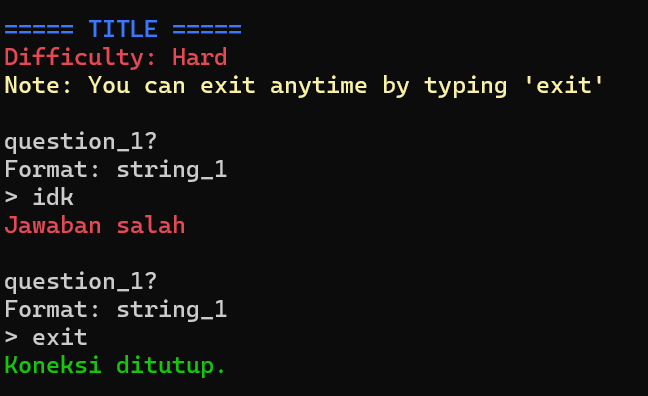

# PYTHON SCRIPT VALIDATOR
This project is designed to validate Python scripts in a Dockerized environment. It can be used for various purposes, including:
- CTF (Capture The Flag) Challenges: Automatically validate answers submitted by players for Python-based challenges.
- Code Review Automation: Validate code for syntax, logic, and structure before deployment.
- Python Learning Platform: Use it as a backend to check Python exercises for students.

## PREVIEW



## Add Questions
To add your Python questions or scripts, simply place them in the `src/` directory. These scripts will be automatically picked up and validated when the container is running.

Be sure to customize the following fields for each challenge:

- **flag**: The expected answer or validation key for the script.
- **title**: The name of the question.
- **difficulty**: Set the challenge level (easy, medium, hard).
- **question**: A description of the task to be solved.
- **answer**: The expected solution for the task.
- **port**: Specify the port on which the service will run (adjust as needed).

## Docker Configuration
Ensure that you've configured the ports properly in the `Dockerfile` and `docker-compose.yml` to avoid conflicts with other services running on your machine.

## Start the Container
To start the Docker container, use the following command:
```.sh
sudo docker-compose up -d
```
This command will start the container in detached mode, running the validator in the background.

## Export Result
If you need to export the validation results, use the provided `export.sh` script:
```.sh
sudo bash export.sh
```
This will generate a `.csv` file containing the results, saved in the `/db` folder.

## Build Your Own Docker Image (docker_image)
If you'd like to customize the environment, you can build your own Docker image using the following command:
```.sh
sudo docker build -t <imagename> .
```
Replace `<imagename>` with a name of your choice for the image.